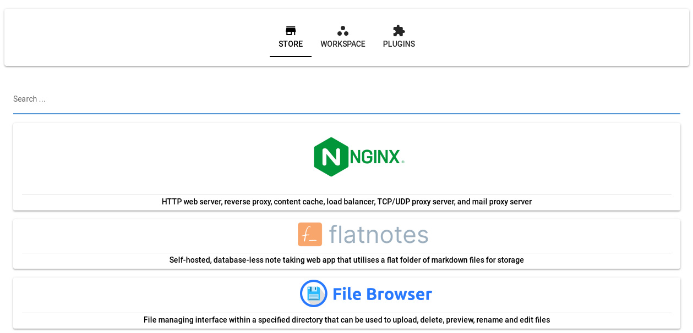
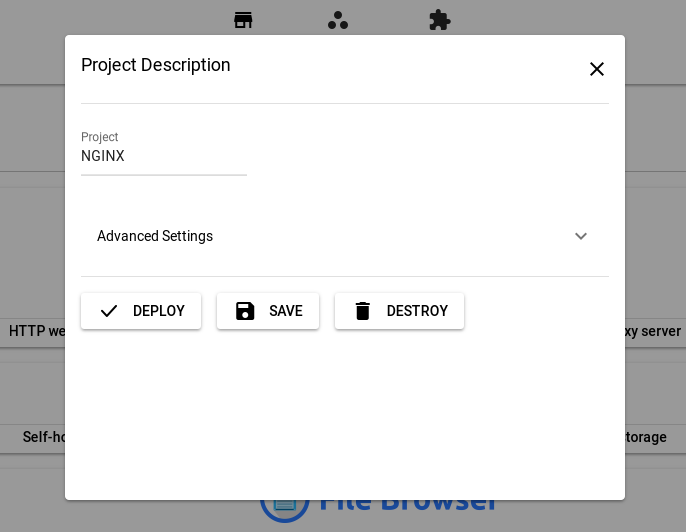
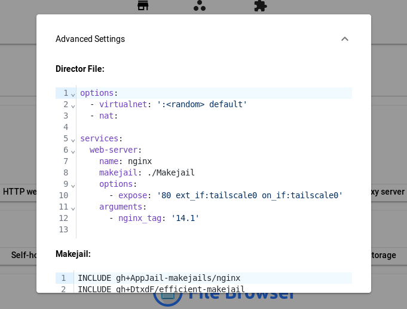
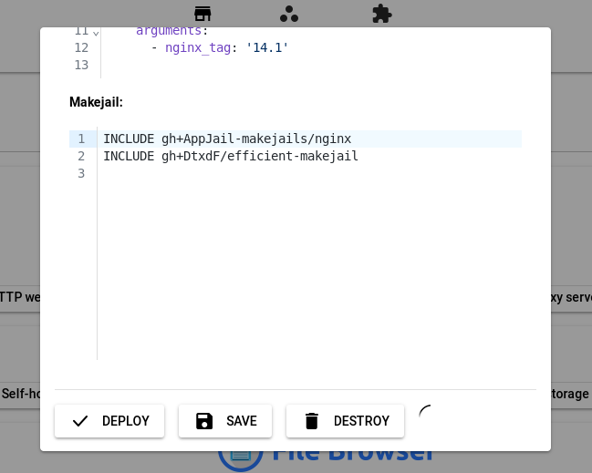
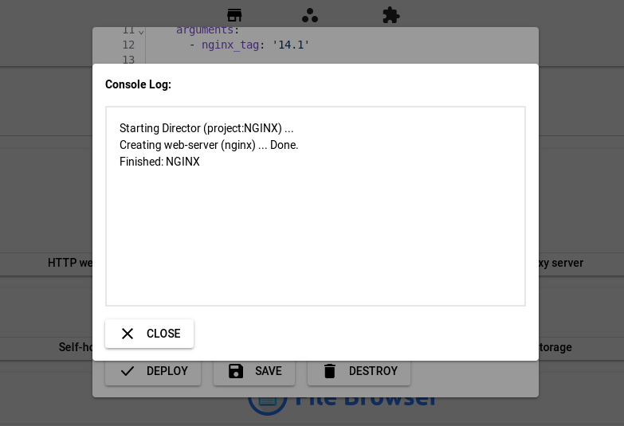
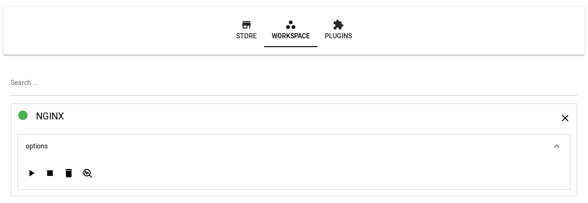
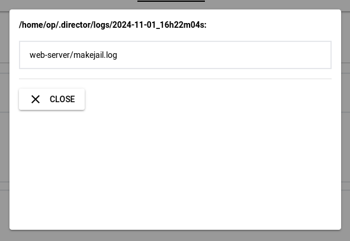
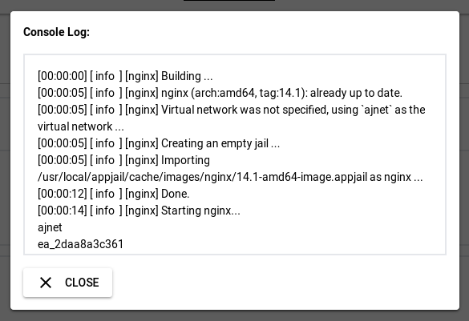
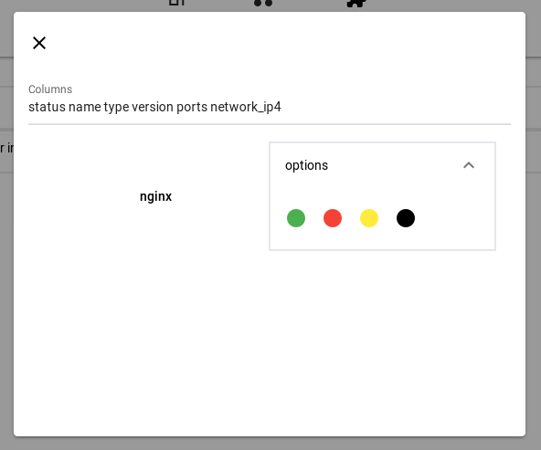
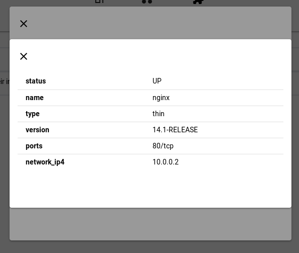

# AppJail (GUI)

AppJail GUI is the graphical user interface for [AppJail](https://github.com/DtxdF/AppJail) and [Director](https://github.com/DtxdF/director), designed to be minimalistic, clean and with a basic plugin system.

## Screenshots

    
Main window

    

        
    

    
Project window

    
    

        
    

    
Advanced settings

    

        
    

    
Deploying ...

    

        
    

    
Deployed!

    

        
    

    
Workspace

    

        
    

    
Logs

    

        
    

    

        
    

    
Jails

    

        
    

    

        
    

